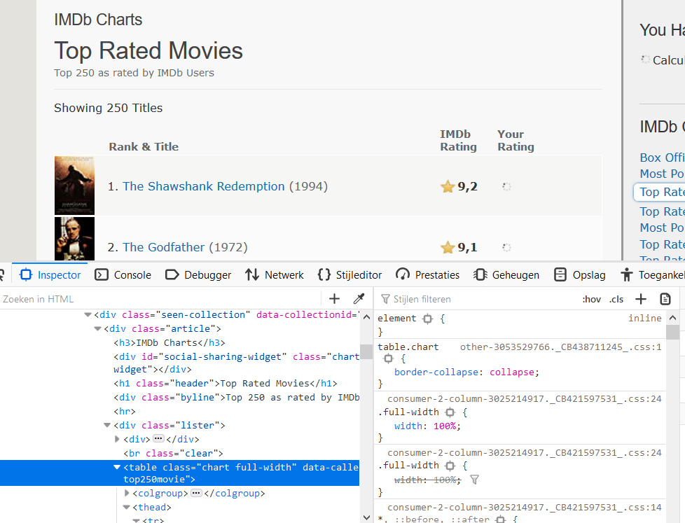

# Python - Top Rated Movies scraper

## Opdracht

Scrape een website om een overzicht te maken van de top 50 films

## Leerdoelen

- Ik codeer met Python een eenvoudige scraper
- Ik codeer met de library BeautifulSoup4
- Ik inspecteer een website met behulp van developer tools

## Uitleg

Elke website bestaat uit html tags die je kunt bekijken met het blote oog. Maar je kunt er ook een zelfgeschreven programma naar laten kijken. 
Sterker nog, je kunt de _data_ uitlezen met code. 

Dat ga je ook doen in deze opdracht. Je gaat een scraper bouwen. Je bouwt een scraper die door een lijst van _imdb.com_ loopt. 


#### HTML

- Je weet dat een website is opgebouwd uit HTML tags.
- Je bent bekend met parent en child tags
- Je bent bekend met `<head>`, `<meta>`, `<h1>`,`a`, `<table>`  tags
- Je bent bekend met tag attributen `id`, `class`

#### Scraping regels

1. Bekijk de voorwaarden van een website op het gebruik van scrapers. Meestal kun je het gewoon doen zolang je maar niet commercieel aan de slag gaat.
2. Scrape niet te aggressief (spamming). Eén _request_ per seconde is goed gebruik.
3. De layout van een website verandered van tijd tot tijd. Blijf dit checken, anders gaat je app kapot.

### Benodigdheden

- Python 3.4
- BeautifulSoup4

1. Installeer Python als je dat nog niet hebt gedaan: https://www.python.org/
2. Installeer BeautifulSoup4 met het volgende commando in je terminal: 

   ```
   pip install beautifulSoup4
   ```
### Stappenplan

1. Inspecteer de site: https://www.imdb.com/chart/top/?ref_=nv_mv_250
2. Bekijk de prijs en bestudeer de gebruikte tags
3. Lanceer je app door in de terminal van je pc te schrijven: `pyton scraper.py`



3. Hier zie je dat de website parent child elementen als volgt zijn:

   ```
    table.chart.full-width
        tbody.lister-list
            td.titleColumn
                a
    ```
4. Coderen van de scraper: Maak een scraper.py bestand

5. Importeer libraries

    ```python
    # importeer libraries
    import urllib2
    from bs4 import BeautifulSoup
    ```

6. Bepaal welke website je wilt scrapen

    ```python
    # Geef de url in een variabele
    url = ''
    ```

7. Maak daarna gebruik van de bij _4_ geimporteerde libraries. Hiermee haal je HTML pagina op.

    ```python
    # query de website en sla deze op in de variabele `pagina`
    pagina = urllib2.urlopen(naam van je url variabele hier neerzetten)
    ```

8. Als laaste verwerken (parsen) we de pagina in een BeautifulSoup format zodat BeautifulSoup haar werk kan doen.

    ```python
    # parse de html door gebruik te maken van BeautifulSoupo en sla deze op in `soep`
    soep = BeautifulSoup(pagina, 'html.parser')
    ```

9. Nu hebben we een variabele `soep` met daarin HTML van de pagina. Nu kunnen we coderen om data eruit te halen. We kunnen de content, in dit geval de __titel__ ophalen met de methode `find()`. Het gaat om de titel __'Top Rated Movies'__

    ```python
    # met `.string` kunnen we de tekst van een HTML element ophalen (net als innerHTML)
    title = soep.find('h1', attrs={'class': 'header'})
    print (title.string)
    ```

10. Willen we de gehele tabel ophalen dan kan dat met ondertaande code, dit is nog __NIET__ wat je wilt.....

    ```python
    table = soep.find('table', attrs={'class': 'chart full-width'})
    print (table)
    ```

11. Je weet nu dan je kunt zoeken in een HTML pagina. Je maakt gebruik van de functie `find()`. Deze functie heeft twee argumenten nodig: _tag naam_ & _attrs-object_. Waarbij je bij het laatste argument `class` of `id` kunt gebruiken. Onderstaande code maakt ook nog eens gebruik van de functie `find_all()` om alle __titleColumns__ op te halen.
    ```python
    all_movies = table.find_all('td', attrs={'class': 'titleColumn'})
    print (all_movies)
    ```python

12. Nu gaan we de link van de film die op nummer 1 staat ophalen  

    ```python
    movie_nmbr_1 = table.find('td', attrs={'class': 'titleColumn'})
    print (movie_nmbr_1.a)
    ```
13. Nu moet jij proberen alleen de titel van bij 13. verkregen anchor tag zien op te halen (_tag_.content)

14. Je weet nu hoe je de titel van 1 film moet ophalen en je weet nu hoe je alle films moet ophalen. Schrijf nu een loop die alle film titels van de Top Rated Movies op imdb.com ophaalt en in je terminal toont.
